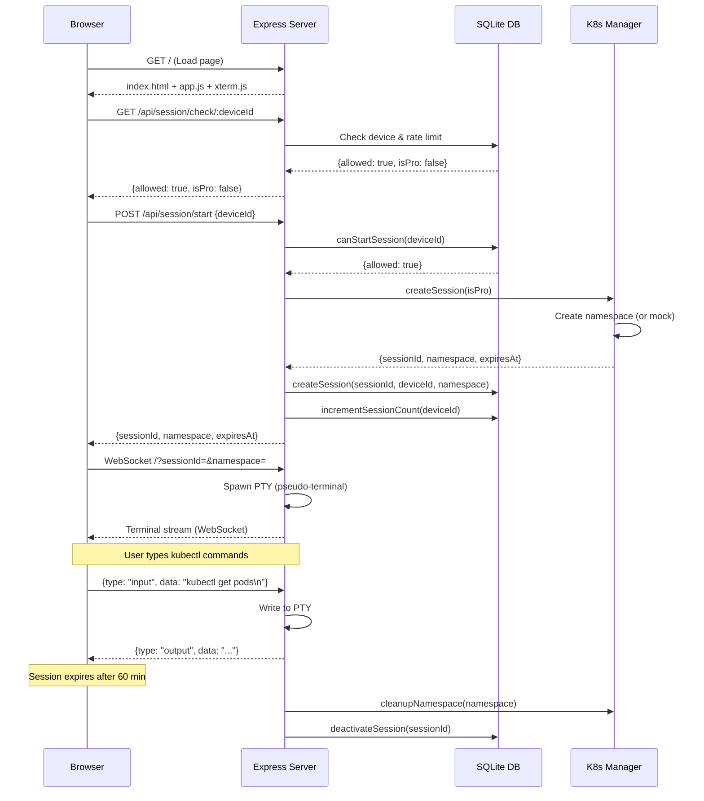
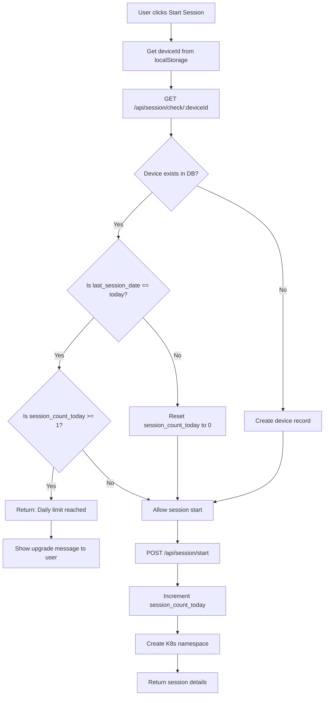
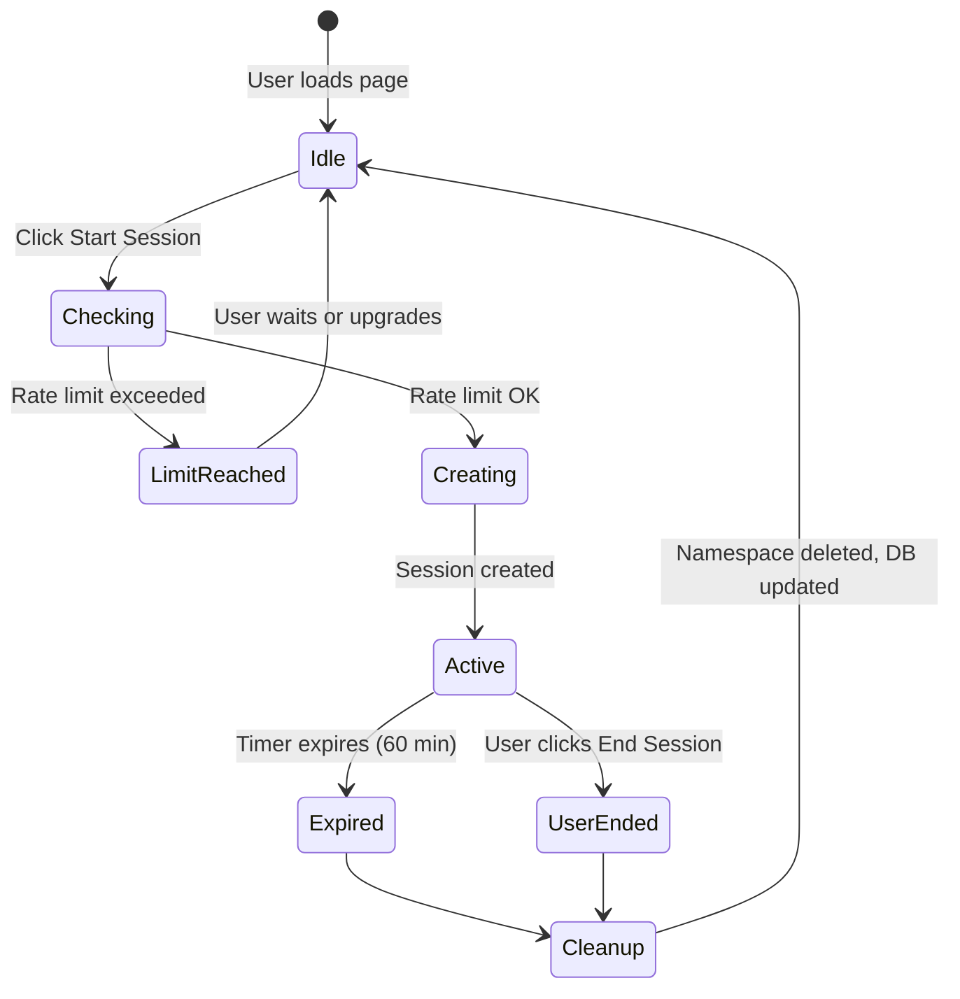

# K8s Sandbox - Phase 1 & 2 Documentation

## Table of Contents
1. [Overview](#overview)
2. [Architecture](#architecture)
3. [Flow Diagrams](#flow-diagrams)
4. [File Structure](#file-structure)
5. [How It Works](#how-it-works)
6. [API Endpoints](#api-endpoints)
7. [Database Schema](#database-schema)
8. [Failure Points & Debugging](#failure-points--debugging)
9. [Setup & Running](#setup--running)
10. [Phase 2 Features](#phase-2-features)

---

## Overview

K8s Sandbox Phase 1 & 2 provides a browser-based Kubernetes learning platform. It allows users to:
- Access a web-based terminal without authentication
- Learn kubectl commands in an isolated environment
- Experience rate-limited free tier (1 session/day, 60 min/session)
- Run in mock mode (no real K8s cluster needed for testing)
- **Phase 2:** Automatic cleanup of expired sessions
- **Phase 2:** Command filtering for free tier users
- **Phase 2:** Landing page with value proposition

**Tech Stack:** Node.js, Express, WebSocket, xterm.js, SQLite, Kubernetes (optional)

---

## Architecture

```
┌─────────────────────────────────────────────────────────────┐
│                        Browser Client                      │
│  ┌──────────────┐    ┌──────────────┐   ┌──────────┐  │
│  │  index.html   │    │  xterm.js    │   │ app.js   │  │
│  │  (Terminal UI)│◄──►│  (Web Term)  │   │(Frontend)│  │
│  └──────────────┘    └──────────────┘   └──────────┘  │
└──────────────┬────────────────────────────────────────────┘
               │ WebSocket (ws://)
               │ HTTP REST API
               ▼
┌─────────────────────────────────────────────────────────────┐
│                     Node.js Server                          │
│  ┌──────────────────────────────────────────────────────┐  │
│  │  server.js (Express + WebSocket Server)              │  │
│  │  - Serves static files                              │  │
│  │  - Handles API routes                               │  │
│  │  - Manages WebSocket terminal connections           │  │
│  └──────────────┬───────────────────────────────────────┘  │
│                 │                                           │
│  ┌──────────────▼───────────────────────────────────────┐  │
│  │  db.js (SQLite Database)                           │  │
│  │  - Device tracking                                │  │
│  │  - Session management                             │  │
│  │  - Rate limiting (1 session/day)                  │  │
│  └──────────────┬───────────────────────────────────────┘  │
│                 │                                           │
│  ┌──────────────▼───────────────────────────────────────┐  │
│  │  k8s-manager.js (Kubernetes Manager)              │  │
│  │  - Mock mode (for testing without K8s)            │  │
│  │  - Real mode (create/delete namespaces)           │  │
│  └──────────────────────────────────────────────────────┘  │
└─────────────────────────────────────────────────────────────┘
```

---

## Flow Diagrams

### 1. User Session Flow



### 2. Rate Limiting Flow



### 3. Session Lifecycle



### 4. Mock Mode vs Real K8s

```mermaid
flowchart LR
    A[server.js] --> B{MOCK_MODE?}
    B -->|true| C[k8s-manager.js]
    C --> D[Mock Namespace<br/>In-memory Set]
    D --> E[Console logs only]
    B -->|false| F[k8s-manager.js]
    F --> G[@kubernetes/client-node]
    G --> H[Real K8s Cluster]
    H --> I[Create/Delete Namespaces]
```

---

## File Structure

```
Web_App/
├── server.js              # Main Express + WebSocket server
├── db.js                  # SQLite database operations
├── k8s-manager.js         # K8s namespace management (mock + real)
├── package.json           # Node.js dependencies
├── .env                   # Environment variables (MOCK_MODE=true)
├── sandbox.db             # SQLite database (auto-created)
├── public/
│   ├── index.html         # Main terminal page
│   ├── app.js             # Frontend JS (terminal + API calls)
│   ├── style.css          # Styling
│   └── pricing.html       # Pricing/subscription page
└── docs/
    └── README.md          # This documentation
```

---

## How It Works

### 1. Device Fingerprinting (No Auth!)

Since there's no authentication, we use a simple device ID stored in `localStorage`:

```javascript
// In public/app.js
let deviceId = localStorage.getItem('deviceId');
if (!deviceId) {
  deviceId = 'dev-' + Date.now() + '-' + Math.random().toString(36).substr(2, 9);
  localStorage.setItem('deviceId', deviceId);
}
```

**Note:** This is NOT secure - users can clear localStorage to bypass limits. It's a "friendly" limit system.

### 2. Session Creation

When a user starts a session:

1. **Check rate limit:** `GET /api/session/check/:deviceId`
   - Looks up device in SQLite
   - Resets counter if it's a new day
   - Returns `{allowed: true/false}`

2. **Create session:** `POST /api/session/start`
   - Calls `k8s-manager.createSession()`
   - In mock mode: adds namespace to in-memory Set
   - In real mode: creates K8s namespace with resource quota
   - Saves session to SQLite
   - Increments device's daily session count

3. **Connect terminal:** WebSocket connection
   - Server spawns a PTY (pseudo-terminal) using `node-pty`
   - Bridges WebSocket ↔ PTY (bidirectional data flow)
   - Starts countdown timer (60 min for free, 120 min for pro)

### 3. Terminal Streaming

```
User types in xterm.js  -->  WebSocket message  -->  PTY receives input
                                                                    |
                                                                    v
xterm.js displays output  <--  WebSocket message  <--  PTY produces output
```

### 4. Session Cleanup

**Automatic cleanup (timer):**
- Frontend timer counts down in browser
- When expires: `DELETE /api/session/:sessionId`
- Server calls `k8s-manager.cleanupNamespace()`
- Server marks session as inactive in DB

**Note:** Phase 1 doesn't have a server-side cleanup cron job yet (coming in Phase 2).

---

## API Endpoints

### GET `/api/session/check/:deviceId`
Check if a device can start a new session.

**Response:**
```json
{
  "allowed": true,
  "reason": null,
  "isPro": false
}
```

### POST `/api/session/start`
Start a new Kubernetes session.

**Request:**
```json
{
  "deviceId": "dev-1234567890-abc123"
}
```

**Response:**
```json
{
  "sessionId": "94374fa0-bb49-469a-ac29-9d59564aec28",
  "namespace": "sandbox-94374fa0-bb49-469a-ac29-9d59564aec28",
  "expiresAt": "2026-04-25T09:05:25.686Z"
}
```

### GET `/api/session/:sessionId`
Get session details.

**Response:**
```json
{
  "session_id": "94374fa0-bb49-469a-ac29-9d59564aec28",
  "device_id": "test-device-123",
  "namespace": "sandbox-94374fa0-bb49-469a-ac29-9d59564aec28",
  "started_at": "2026-04-25 08:05:25",
  "expires_at": "2026-04-25T09:05:25.686Z",
  "is_active": 1
}
```

### DELETE `/api/session/:sessionId`
End a session and cleanup resources.

**Response:**
```json
{
  "success": true
}
```

### WebSocket `/`
Terminal connection (upgrade from HTTP).

**Query Params:** `?sessionId=...&namespace=...`

**Message Types:**
- Client → Server: `{type: "input", data: "kubectl get pods\n"}`
- Client → Server: `{type: "resize", cols: 80, rows: 24}`
- Server → Client: `{type: "output", data: "..."}`

---

## Database Schema

### Table: `devices`
Tracks devices and their daily usage.

| Column | Type | Description |
|--------|------|-------------|
| device_id | TEXT (PK) | Unique device identifier |
| last_session_date | TEXT | Last session date (YYYY-MM-DD) |
| session_count_today | INTEGER | Sessions started today |
| is_pro | INTEGER | 1 if pro user, 0 if free |
| created_at | DATETIME | When device first visited |

### Table: `sessions`
Tracks active/inactive sessions.

| Column | Type | Description |
|--------|------|-------------|
| session_id | TEXT (PK) | UUID of the session |
| device_id | TEXT (FK) | References devices.device_id |
| namespace | TEXT | K8s namespace name |
| started_at | DATETIME | Session start time |
| expires_at | DATETIME | Session expiration time |
| is_active | INTEGER | 1 if active, 0 if ended |

### Table: `subscriptions`
Reserved for Phase 3 (payment integration).

| Column | Type | Description |
|--------|------|-------------|
| device_id | TEXT (PK) | References devices.device_id |
| stripe_customer_id | TEXT | Stripe customer ID |
| stripe_subscription_id | TEXT | Stripe subscription ID |
| status | TEXT | active, cancelled, etc. |
| expires_at | DATETIME | Subscription expiration |
| created_at | DATETIME | When subscribed |

---

## Failure Points & Debugging

### 1. Server Won't Start

**Symptom:** `Error: ENOENT: no such file or directory, open '/home/user/.kube/config'`

**Cause:** K8s config path is wrong (Windows vs Linux).

**Fix:** Use `MOCK_MODE=true` in `.env` for testing without K8s.

---

### 2. Session Creation Fails

**Symptom:** `{"error":"getaddrinfo ENOTFOUND ..."}`

**Cause:** K8s cluster in kubeconfig is unreachable.

**Fix:**
```bash
# Check .env
echo "MOCK_MODE=true" >> .env

# Restart server
pkill -f "node server.js"
node server.js
```

---

### 3. Rate Limiting Not Working

**Symptom:** User can start multiple sessions in a day.

**Cause:** Device ID not persisting (localStorage cleared).

**Debug:**
```javascript
// In browser console
console.log(localStorage.getItem('deviceId'));
```

**Fix:** Check if `app.js` is properly saving deviceId.

---

### 4. WebSocket Connection Fails

**Symptom:** Terminal shows "Disconnected" immediately.

**Cause:** Wrong WebSocket URL or server not running.

**Debug:**
```bash
# Check if server is running
curl http://localhost:3000/

# Check browser console (F12) for WebSocket errors
```

---

### 5. Database Issues

**Symptom:** `Error: SQLITE_ERROR: no such table`

**Cause:** Database not initialized.

**Fix:**
```bash
# Delete old DB and restart
rm sandbox.db
node server.js
# Server auto-creates tables on startup
```

**Check DB contents:**
```bash
# Use Node.js to query (sqlite3 CLI not available on Windows)
node -e "const db = require('./db'); db.getDevice('test').then(console.log);"
```

---

### 6. Terminal Not Displaying

**Symptom:** Blank screen where terminal should be.

**Cause:** xterm.js not loading or container not sized.

**Debug:**
```javascript
// In browser console
term = new Terminal();
term.open(document.getElementById('terminal'));
term.write('Hello from xterm!\n');
```

**Fix:** Check if `xterm.css` and `xterm.js` are loading from CDN.

---

### 7. Mock Mode Not Working

**Symptom:** Still trying to connect to K8s.

**Cause:** `.env` not loaded or `MOCK_MODE` not set.

**Fix:**
```bash
# Check .env file
cat .env
# Should contain: MOCK_MODE=true

# Restart server (dotenv loads on startup)
node server.js
```

Check server logs for:
```
◇ injected env (3) from .env
K8s Sandbox server running on http://localhost:3000
```

---

## Phase 2 Features

### 1. Automatic Session Cleanup (`cleanup.js`)

The cleanup job runs every 5 minutes and removes expired sessions.

**What it does:**
1. Queries database for sessions where `expires_at < NOW()`
2. Deletes the Kubernetes namespace for each expired session
3. Marks the session as inactive in the database

**Running the cleanup job:**
```bash
# Automatic (runs with server.js)
npm start
# Check logs for: [Cleanup] Checking for expired sessions...

# Manual cleanup
node cleanup.js
```

**Flow Diagram:**
```mermaid
flowchart TD
    A[Cleanup Job - Every 5 min] --> B[Query DB: SELECT * FROM sessions WHERE expires_at < NOW()]
    B --> C{Expired sessions?}
    C -->|No| D[Log: No expired sessions]
    C -->|Yes| E[For each expired session]
    E --> F[Delete K8s namespace]
    F --> G[Mark session as inactive in DB]
    G --> H[Log: Session cleaned up]
```

---

### 2. Command Filtering (`command-filter.js`)

Free tier users can only run safe kubectl commands. Pro users have full access.

**Free Tier Allowed Commands:**
- Read-only: `get`, `describe`, `version`, `cluster-info`, `config view`, `api-resources`, `explain`, `auth can-i`
- Safe operations: `run`, `expose`, `scale`, `autoscale`, `rollout status`, `rollout history`
- Debugging: `logs`, `top`

**Restricted Patterns (Free Tier):**
- Delete operations: `delete namespace`, `delete --all`
- RBAC modifications: `create role`, `apply rolebinding`, etc.
- Node operations: `taint node`, `cordon node`, `drain node`
- Dangerous flags: `--force --grace-period=0`

**Implementation:**
```javascript
// In server.js WebSocket handler
if (!isPro && message.data.trim().startsWith('kubectl')) {
  const filterResult = commandFilter.filterCommand(message.data, false);
  if (!filterResult.allowed) {
    ptyProcess.write(`\x1b[31m${filterResult.reason}\x1b[0m\r\n`);
    return; // Block the command
  }
}
ptyProcess.write(message.data); // Allowed - send to terminal
```

---

### 3. Landing Page (`landing.html`)

A value proposition page served at `/` to attract new users.

**Features:**
- Hero section with CTA button
- Feature cards (Zero Setup, Isolated & Safe, Real Terminal, Beginner Friendly)
- How It Works section (3 steps)
- Pricing preview section

**Routes:**
- `/` → Landing page (landing.html)
- `/terminal` → Terminal page (index.html)
- `/pricing.html` → Pricing page

---

## Setup & Running

### Prerequisites
- Node.js 16+ (v18+ recommended for production)
- npm
- (Optional) Kubernetes cluster for real mode

### Quick Start (Mock Mode)

```bash
# 1. Clone/download the project
cd Web_App

# 2. Install dependencies
npm install

# 3. Configure environment
echo "MOCK_MODE=true" > .env
echo "PORT=3000" >> .env

# 4. Start the server
npm start

# 5. Open browser
# Navigate to http://localhost:3000
```

### Testing the API

```bash
# Check device status
curl http://localhost:3000/api/session/check/test-device-123

# Start a session
curl -X POST http://localhost:3000/api/session/start \
  -H "Content-Type: application/json" \
  -d '{"deviceId":"test-device-123"}'

# Try starting second session (should fail)
curl -X POST http://localhost:3000/api/session/start \
  -H "Content-Type: application/json" \
  -d '{"deviceId":"test-device-123"}'
# Should return: {"error":"Daily session limit reached..."}

# Get session details
curl http://localhost:3000/api/session/{sessionId}

# End session
curl -X DELETE http://localhost:3000/api/session/{sessionId}
```

---

## Phase 1 Limitations (Fixed in Phase 2)

- [x] No server-side session cleanup cron → **Fixed:** `cleanup.js` runs every 5 minutes
- [x] No command filtering → **Fixed:** `command-filter.js` restricts free tier commands
- [ ] Device ID can be bypassed by clearing localStorage (by design - "friendly" limits)
- [ ] No guided tutorials (Phase 3)
- [ ] No payment integration (Phase 3)

## Phase 2 Limitations (To Be Fixed in Phase 3)

- [ ] No payment integration (Stripe/Razorpay)
- [ ] No guided tutorials
- [ ] Command filtering can be bypassed (users can type `kubectl` commands directly in terminal)
- [ ] Landing page is static (no dynamic content)
- [ ] No analytics to track user behavior

---

**For Contributors:** Follow the flow diagrams above to understand the system. Check "Failure Points" section when debugging issues.
